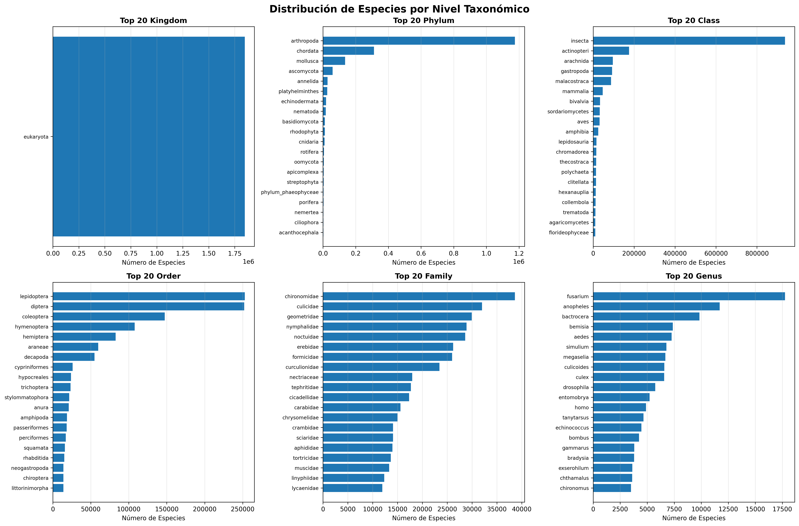

```
╔════════════════════════════════════════════════════════════════════════════╗
║                                                                            ║
║  ██████╗ ██╗ ██████╗ ██╗  ██╗ █████╗  ██████╗ ██╗  ██╗                     ║
║  ██╔══██╗██║██╔═══██╗██║  ██║██╔══██╗██╔════╝ ██║ ██╔╝                     ║
║  ██████╔╝██║██║   ██║███████║███████║██║      █████╔╝                      ║
║  ██╔══██╗██║██║   ██║██╔══██║██╔══██║██║      ██╔═██╗                      ║
║  ██████╔╝██║╚██████╔╝██║  ██║██║  ██║╚██████╗ ██║  ██╗                     ║
║  ╚═════╝ ╚═╝ ╚═════╝ ╚═╝  ╚═╝╚═╝  ╚═╝ ╚═════╝ ╚═╝  ╚═╝                     ║
║                                                                            ║
╚════════════════════════════════════════════════════════════════════════════╝
```

# Investigathon

Solución al track Bioinformática del Investigathon.

## 🎯 Problemática y Statement

Este proyecto aborda el desafío de **identificación taxonómica de especies** mediante análisis de secuencias de ADN del gen **CO1** (Citocromo Oxidasa Subunidad I). Utilizamos el dataset **MIDORI2** que contiene:

- **~1,846,396 registros** de secuencias de referencia
- **~235,083 especies únicas** con clasificación taxonómica completa
- Secuencias de longitudes variables (100-2,298 bases, promedio ~693 bases)

### Desafíos Principales

1. **Análisis de Entropía**: Analizar la variabilidad genética dentro y entre especies, considerando que las secuencias tienen longitudes diferentes.

2. **Representación de Secuencias**: Encontrar una representación numérica adecuada de las secuencias para comparación (K-mers, embeddings, alineamiento).

3. **Clasificación de Especies**: Clasificar secuencias desconocidas en `query.fasta` a nivel de especie usando algoritmos de machine learning.



## 🚀 Cómo Ejecutar

### Paso 0: Instalación de Poetry

Si no tienes Poetry instalado:

```bash
pip install poetry
```

### Paso 1: Instalación de Dependencias

```bash
poetry install
```

**Dependencias principales:**
- **pandas**: Manipulación y análisis de datos
- **matplotlib**: Visualización de datos
- **numpy**: Operaciones numéricas

### Paso 2: Cargar Dataset

```bash
poetry run python3 loader.py
```

Esto cargará los archivos y mostrará un resumen del dataset:
- Total de registros
- Número de secuencias únicas
- Número de especies únicas
- Estadísticas de longitud de secuencias

### Paso 3: Ejecutar Análisis Exploratorio de Datos (EDA)

```bash
poetry run python3 eda.py
```

Esto generará múltiples visualizaciones y estadísticas:
- **distribucion_por_taxon.png**: Distribución de especies por cada nivel taxonómico (Reino, Filo, Clase, Orden, Familia, Género)
- **heatmap_distribucion.png**: Heatmap mostrando la distribución de secuencias por Reino y Filo
- **distribucion_longitudes.png**: Histograma y boxplot de las longitudes de secuencias
- **top_especies.png**: Top 30 especies con más secuencias
- **longitudes_por_reino.png**: Comparación de longitudes de secuencias agrupadas por reino
- **estadisticas_taxones.png**: Número de taxones únicos por nivel taxonómico

El script también imprime estadísticas descriptivas en consola.

## 📋 Descripción del Proyecto

### Contexto Biológico

- **Gen CO1**: Marcador genético estándar para identificación de especies (DNA barcoding)
- **Variabilidad intra-especie**: Las secuencias de la misma especie pueden tener pequeñas diferencias (mutaciones silenciosas)
- **Desafío**: Identificar especies desconocidas comparándolas con una base de datos de referencia

### Arquitectura de Datos

El sistema trabaja con dos tablas relacionadas:

1. **Archivo `.taxon`**: Contiene las etiquetas taxonómicas (Reino, Filo, Clase, Orden, Familia, Género, Especie)
2. **Archivo `.fasta`**: Contiene las secuencias de ADN en formato FASTA
3. **Archivo `query.fasta`**: Secuencias desconocidas que deben ser clasificadas

**Clave de unión**: El `sequence_id` (ej: `MG559732.1`) vincula ambas tablas.

## 🎯 Problemáticas a Resolver

### Problema 1: Análisis de Entropía
- **Objetivo**: Analizar la variabilidad genética dentro y entre especies
- **Desafío**: Las secuencias tienen longitudes diferentes (690, 897 bases, etc.)
- **Enfoque**: Necesita alineamiento o métodos que toleren diferentes longitudes

### Problema 2: Representación de Secuencias
- **Objetivo**: Encontrar una representación numérica de las secuencias para comparación
- **Desafío**: Las secuencias no tienen el mismo largo
- **Enfoque**: Considerar métodos como K-mers, embeddings, o técnicas de alineamiento

### Problema 3: Clasificación de Secuencias Desconocidas
- **Objetivo**: Clasificar las secuencias en `query.fasta` a nivel de especie
- **Desafío**: Determinar la especie más probable para cada secuencia desconocida
- **Enfoque**: Usar algoritmos de clasificación (KNN, árboles de decisión, redes neuronales, etc.)

## ✅ Progreso Actual

### [x] Setup del Proyecto
- [x] Configuración de Poetry como gestor de dependencias
- [x] Estructura básica del proyecto

### [x] Carga y Preprocesamiento de Datos
- [x] Script `loader.py` para cargar archivos `.taxon` y `.fasta`
- [x] Extracción de IDs base para unión de tablas
- [x] Parseo de información taxonómica (Reino → Especie)
- [x] Extracción de secuencias completas de ADN
- [x] Unión de datos en DataFrame de pandas
- [x] Validación de datos cargados
- [x] Normalización de nombres taxonómicos (lowercase, espacios a guiones bajos)

### [x] Análisis Exploratorio de Datos (EDA)
- [x] Script `eda.py` con visualizaciones completas
- [x] Distribución de especies por nivel taxonómico
- [x] Heatmap de distribución Reino-Filo
- [x] Análisis de longitudes de secuencias (histograma y boxplot)
- [x] Top especies más frecuentes
- [x] Comparación de longitudes por reino
- [x] Estadísticas descriptivas del dataset

### [ ] Problema 1: Análisis de Entropía
- [ ] Implementar método de alineamiento o normalización de longitudes
- [ ] Calcular entropía por posición en secuencias alineadas
- [ ] Analizar variabilidad intra-especie vs inter-especie
- [ ] Visualización de resultados

### [ ] Problema 2: Representación de Secuencias
- [ ] Implementar extracción de K-mers
- [ ] Evaluar otros métodos de representación (embeddings, one-hot encoding)
- [ ] Comparar diferentes valores de K
- [ ] Reducción de dimensionalidad si es necesario

### [ ] Problema 3: Clasificación
- [ ] Implementar algoritmo de clasificación
- [ ] Entrenar modelo con datos de referencia
- [ ] Clasificar secuencias de `query.fasta`
- [ ] Evaluar precisión y métricas de rendimiento
- [ ] Generar reporte de resultados

## 📊 Estadísticas del Dataset

- **Total de registros**: ~1,846,396
- **Secuencias únicas**: ~1,773,970
- **Especies únicas**: ~235,083
- **Longitud promedio**: ~693.3 bases
- **Longitud mínima**: 100 bases
- **Longitud máxima**: 2,298 bases

> 💡 **Nota**: Ejecuta `poetry run python3 eda.py` para obtener estadísticas detalladas y visualizaciones completas del dataset.

## 💻 Uso Avanzado

### Usar el Loader en Otros Scripts

```python
from loader import cargar_dataset

# Cargar con normalización activada (por defecto)
df = cargar_dataset('MIDORI2_UNIQ_NUC_GB268_CO1.taxon', 
                    'MIDORI2_UNIQ_NUC_GB268_CO1.fasta')

# Cargar sin normalización
df = cargar_dataset('MIDORI2_UNIQ_NUC_GB268_CO1.taxon', 
                    'MIDORI2_UNIQ_NUC_GB268_CO1.fasta', 
                    normalizar=False)
```

### Usar el EDA en Otros Scripts

```python
from eda import ejecutar_eda, calcular_estadisticas
from loader import cargar_dataset

# Ejecutar EDA completo
ejecutar_eda()

# O usar funciones individuales
df = cargar_dataset('MIDORI2_UNIQ_NUC_GB268_CO1.taxon', 
                    'MIDORI2_UNIQ_NUC_GB268_CO1.fasta')
stats = calcular_estadisticas(df)
```

## 👥 Autores

- Octavio Pavón
- Jeremias Tanoni
- Valentin Altoe
- Delfina Mosqueira
